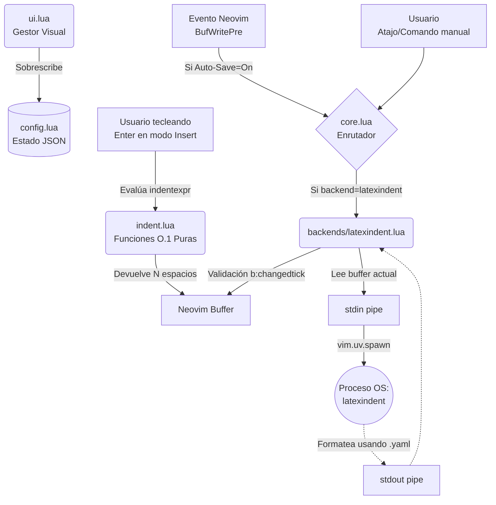
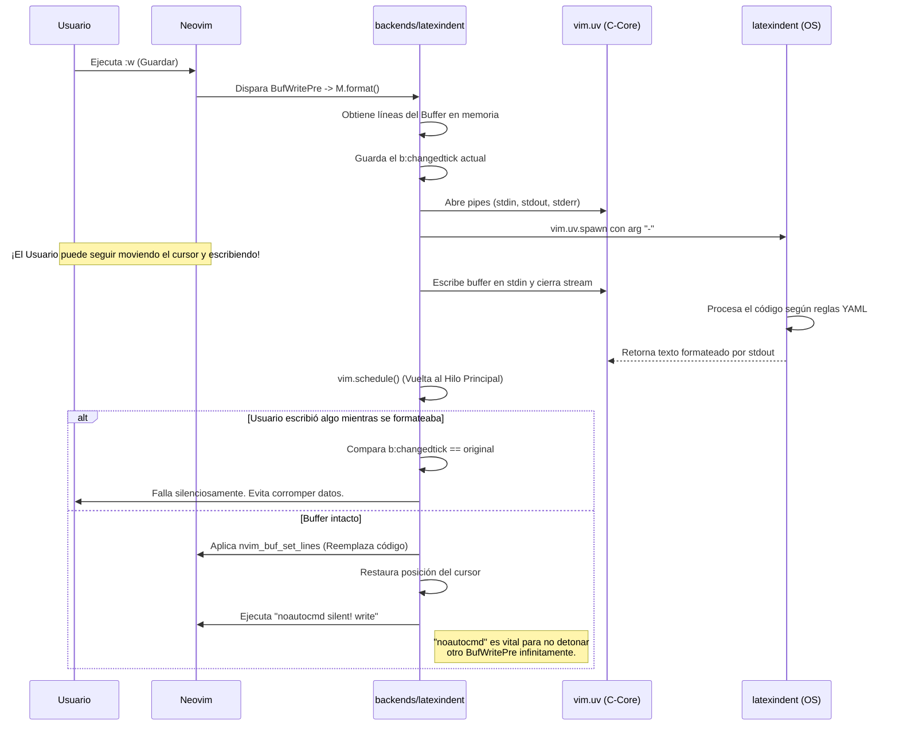

# 💻 Documentación para Desarrolladores: `arttexformat.nvim`

Este documento expone la arquitectura técnica de **ArtTeX Format**. El diseño prioriza la eficiencia extrema, delegando las tareas triviales a funciones Lua puras asintóticas (O(1)) y enviando la computación pesada al Sistema Operativo sin bloquear el Single-Thread de Neovim.

---

## 🏗 Arquitectura del Sistema

El plugin posee dos motores totalmente independientes trabajando en paralelo: el motor de tiempo real (`indent.lua`) y el motor asíncrono profundo (`latexindent.lua`).

---

## ⏱ Diagrama de Secuencia (El flujo del Motor Asíncrono)

Para comprender cómo se gestionan las llamadas asíncronas y cómo evitamos los temidos "bucles infinitos" al guardar, observa esta secuencia:

---

## 📂 Descripción Detallada de Módulos y Funciones

### 1. `lua/arttexformat/init.lua`
Punto de entrada de Neovim y gestor del ciclo de vida del plugin.
* `M.setup(opts)`: Carga el JSON, expone los comandos `:ArtFormatConfig`, `:ArtTexFormat` y `:ArtFormatEditRules`. 
* **Eventos y Hooks:** En un evento `FileType tex`, inyecta dinámicamente los atajos Which-Key (`<leader>lf`, `<leader>lF`, `<leader>lr`) y si la opción está activa, vincula la función nativa al `indentexpr`. 
* También registra el `BufWritePre` para detonar el formato asíncrono al guardar.

### 2. `lua/arttexformat/config.lua`
Gestor del estado persistente (Single Source of Truth).
* `M.load_json()` / `M.save_json(opts)`: Funciones seguras (`pcall`) que interactúan con `~/.config/nvim/arttexformat_config.json`.
* Alberga la ruta `latexindent_config_dir` por defecto apuntando directamente al interior de la carpeta del propio plugin, garantizando cohesión y facilidad de edición en el ecosistema.

### 3. `lua/arttexformat/indent.lua`
Capa de indentación nativa ultra veloz.
* `M.get_indent(lnum)`: A diferencia de costosos scripts de formateo, esta función puramente matemática se ejecuta cada que el usuario da "Enter". Examina por regex si la línea anterior (`prev_line`) abre un entorno (`\begin`, `\[`) para sumar `shiftwidth`. Asimismo, si el usuario escribe `\end`, la sangría retrocede automáticamente. Tiempo de cómputo: **~0.01 milisegundos**.
* `M.setup_buffer(bufnr)`: Configura localmente las variables de vim `indentexpr` y `indentkeys`.

### 4. `lua/arttexformat/core.lua`
El Enrutador.
* `M.format_buffer(is_manual)`: Revisa que el archivo realmente sea de tipo LaTeX. Dependiendo de `config.options.backend`, transfiere el control a la capa de infraestructura.

### 5. `lua/arttexformat/ui.lua`
Capa de Interfaz de Usuario.
* `M.open_menu()`: Puente de comunicación con `arttexworkspace.ui.menu_builder`. Construye el modelo de datos visual (toggles) permitiendo mutar la configuración (`auto_format_on_save`, `use_realtime_indent`) y guardar al vuelo. Lanza llamadas recursivas con `vim.defer_fn` para redibujar el menú tras un clic.

### 6. `lua/arttexformat/backends/latexindent.lua`
El núcleo asíncrono del formateador pesado. Toda comunicación con el Sistema Operativo ocurre aquí.
* `M.format(bufnr, is_manual)`:
  1. Extrae todo el buffer de forma silenciosa.
  2. Genera pipes usando la API `vim.uv` de Neovim 0.10+ (sucesor de libuv/vim.loop).
  3. Ejecuta `latexindent -l <ruta_plugin>/setting_latexindent.yaml -`. El `-` final es imperativo: ordena a Perl que absorba el código proveniente de `stdin` en lugar de buscar archivos en disco duro.
  4. **Protección Race Condition:** Mide el `vim.api.nvim_buf_get_changedtick(bufnr)` antes y después. Si no coinciden, aborta la inyección (Early Return).
  5. **Restauración Segura:** Una vez reemplazadas las líneas con el output de stdout, recoloca al usuario en la línea original para que no note el "salto".
  6. **Auto-Guardado:** Si el trigger no fue manual, salva físicamente usando el comando mágico `:noautocmd silent! write` para eludir la propagación en cascada de eventos de autoguardado.
