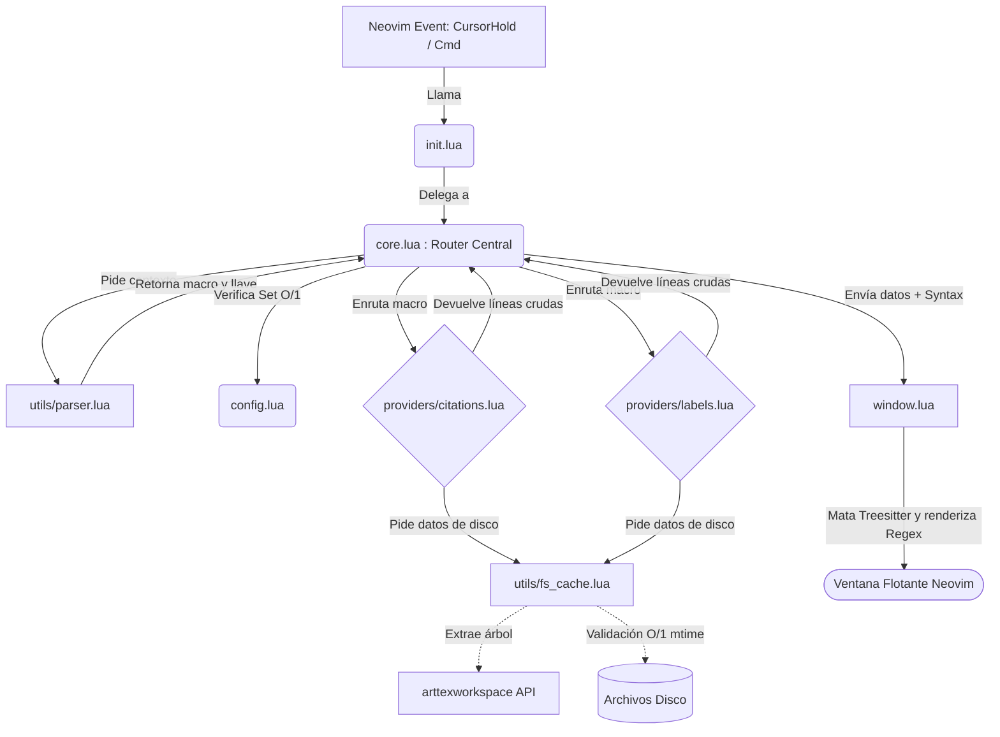

# Documentación para Desarrolladores: `arttexhover.nvim`

El plugin está estructurado siguiendo los principios de la **Arquitectura Limpia (Clean Architecture)**. La separación rigurosa de responsabilidades (Routing, Parsing, Cache de Datos, Interfaz de Ventana) asegura la extrema optimización y escalabilidad del plugin.

## 🏗 Arquitectura de Alto Nivel

---

## 📂 Descripción Detallada por Módulo y Funciones

### 1. `init.lua` (Punto de Entrada)
Registra los comandos de usuario y define el ciclo de vida inicial.
- **`M.setup(opts)`**: 
  - Inicializa la configuración llamando a `config.setup`.
  - Registra el comando `:ArtHoverConfig` mapeado hacia `ui.open_menu()`.
  - Registra el comando manual `:ArtTexHover`.
  - Crea el `augroup` y `autocmd` **`CursorHold`** para el auto-hover en archivos `.tex`. Este evento verifica si `config.options.auto_hover` está activo antes de inyectar la carga al `core.lua`.

### 2. `config.lua` (Estado y Configuración)
Maneja las preferencias y los Hash Sets de optimización O(1).
- **`M.load_json()`**: Lee de manera segura `~/.config/nvim/arttexhover_config.json` retornando la tabla deserializada o `nil`.
- **`M.save_json(opts)`**: Codifica y persiste la tabla en JSON en el disco duro.
- **`M.setup(opts)`**: Combina los parámetros pasados en el `setup` con la base de datos local y refresca la caché de macros.
- **`M.rebuild_sets()`**: Convierte las listas puras (arrays) de comandos en Diccionarios (Hash Sets, e.g. `sets.cites["cite"] = true`). Fundamental para el *pattern matching* ultrarrápido en el `core.lua`.

### 3. `core.lua` (El Router / Capa de Negocio)
Es la central telefónica del plugin; no parsea texto y no abre ventanas, simplemente gestiona los puentes lógicos.
- **`M.hover(is_manual)`**: 
  1. Invoca a `parser.get_context_under_cursor()`.
  2. Evalúa en tiempo O(1) si el macro detectado corresponde a citas, referencias o paquetes.
  3. Despacha al proveedor correspondiente pasando el buffer actual y un _callback_.
  4. Envía la respuesta asíncrona hacia `window.show()`.
  5. Contiene lógica de *fallback*. Si `is_manual` es verdadero y no se detecta código LaTeX, delega el trabajo al LSP de Neovim (`vim.lsp.buf.hover()`).

### 4. `utils/parser.lua` (Análisis Heurístico)
- **`M.get_context_under_cursor()`**: 
  Extrae de la línea actual de Neovim (`vim.api.nvim_get_current_line()`) el macro bajo el cursor. Utiliza patrones Lua altamente optimizados para aislar `\macro[opt]{llave_bajo_cursor}`. Resuelve colisiones limpiamente (e.g. si estás entre `\cite{foo, bar}` extrae independientemente si estás sobre `foo` o sobre `bar`). Retorna `macro, llave`.

### 5. `utils/fs_cache.lua` (Caché Asíncrono libuv - 0 Latencia)
El corazón de la optimización y bajísimo uso de RAM.
- **`M.read_file_cached(filepath)`**: Recibe una ruta. Llama a `vim.uv.fs_stat` para obtener los milisegundos de modificación del archivo (`mtime.sec`). Si el archivo en disco no ha cambiado, sirve la *string* almacenada en su caché RAM interno instantáneamente. Si ha sido modificado (Cache Miss), abre `io.open` y lo cachea.
- **`M.iter_cached_files(project_tree, extension)`**: Expone un iterador funcional que filtra el `project_tree` de `arttexworkspace` por una extensión (`%.tex$` o `%.bib$`) y rinde (yield) el contenido purificado en memoria.

### 6. Proveedores (`providers/citations.lua` y `providers/labels.lua`)
La Capa de Servicios:
- **`M.get_hover_info(bufnr, target_key, callback)`**:
  - Obtiene el árbol del proyecto mediante la API transversal: `workspace.api.get_project_config(bufnr)`.
  - Recorre el iterador de `fs_cache` para encontrar la llave correspondiente.
  - Almacena el resultado (Ej: 3 líneas de código puro antes y después del `\label`).
  - Llama al _callback_ enviando el código en formato **crudo (Raw)** y su tipo de archivo (`"tex"` o `"bib"`), asegurando evitar la sobrecarga de formateros markdown externos.

### 7. `window.lua` (Motor de Renderizado)
- **`M.close()`**: Elimina el `active_win` y `active_buf` de manera segura, si existiesen.
- **`M.show(lines, title, filetype)`**:
  - Construye un Buffer oculto (scratch, unlisted).
  - Calcula matemáticamente las dimensiones para que el tamaño de la ventana sea exacto a la longitud del bloque LaTeX.
  - Abre la ventana usando la API base pura de Neovim (`vim.api.nvim_open_win`).
  - **Sintaxis Crítica**: Define dinámicamente `filetype`, aísla y **mata cualquier instancia de Treesitter** (`pcall(vim.treesitter.stop, buf)`), e invoca `vim.bo.syntax = filetype` para garantizar un renderizado Legacy C-core (Regex) de manera indestructible y hermética.
  - Implementa el _autocmd_ de auto-destrucción inteligente de la ventana al mover el cursor (`CursorMoved`).

### 8. `ui.lua` (Dashboard)
- **`M.open_menu()`** y **`M.edit_list()`**: Proveen la fachada de configuración apoyándose rígidamente en la API visual nativa del ecosistema `menu_builder.create_menu` importada de `arttexworkspace.ui.menu_builder`.
