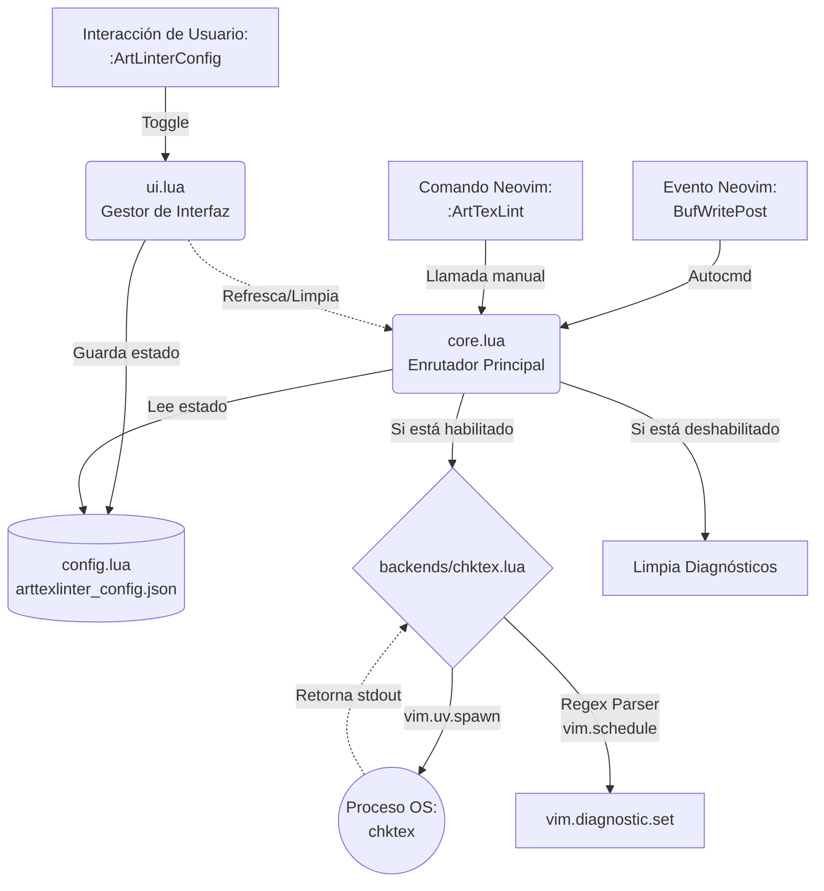
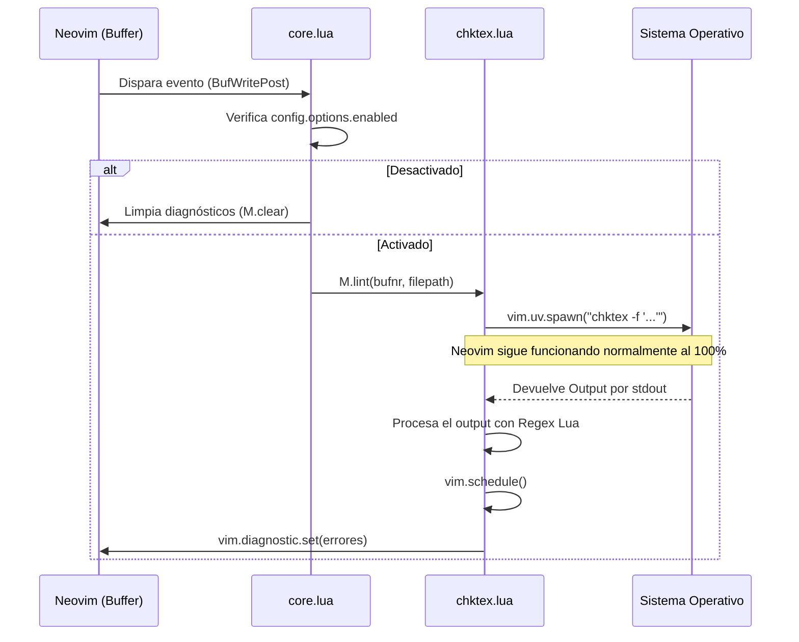

# 💻 Documentación para Desarrolladores: `arttexlinter.nvim`

Este documento explica en detalle la arquitectura interna del plugin, el flujo de ejecución, y la responsabilidad de cada función. El código sigue los principios de **Clean Architecture**, aislando la interfaz gráfica (UI), la lógica de negocio (Core) y la infraestructura (Backends).

---

## 🏗 Arquitectura de Alto Nivel

El flujo de información es estrictamente unidireccional para mantener la previsibilidad del estado.

---

## ⏱ Diagrama de Secuencia (El flujo del Linting)

Así es como se ejecuta el linter de manera 100% asíncrona sin bloquear la UI de Neovim.

---

## 📂 Descripción Detallada de Módulos y Funciones

### 1. `lua/arttexlinter/init.lua`
Punto de entrada de Neovim. Inicializa el plugin, crea los comandos de usuario y registra los eventos automáticos (Autocmds).
* `M.setup(opts)`: Función principal. Carga la configuración, registra los comandos `:ArtLinterConfig` y `:ArtTexLint`, y configura el `augroup` `ArtTexAutoLinter` para escuchar los eventos declarados (ej. `BufWritePost`). Utiliza `vim.defer_fn` al cargar para lanzar una revisión inicial tras 500ms si se abre un archivo `.tex`.

### 2. `lua/arttexlinter/config.lua`
Gestor del estado persistente. Encargado de guardar en disco si el linter está encendido o apagado para que sobreviva a los reinicios de Neovim.
* `M.options`: Tabla en memoria con las opciones (enabled, backend, chktex_args).
* `M.load_json()`: Lee el archivo `~/.config/nvim/arttexlinter_config.json`, lo parsea de manera segura con `pcall(vim.fn.json_decode)` y retorna la tabla Lua.
* `M.save_json(opts)`: Serializa el estado actual (`vim.fn.json_encode`) y escribe (sobrescribe) el archivo JSON en el disco duro.
* `M.setup(opts)`: Combina la configuración por defecto, lo guardado en el JSON, y los argumentos que el usuario envíe en su `init.lua`.

### 3. `lua/arttexlinter/core.lua` (El Router)
Capa de negocio. Conecta la solicitud de Neovim con el analizador correspondiente (backend), validando primero si está permitido ejecutarse.
* `M.lint()`: Obtiene el `bufnr` y `filepath` actual. Comprueba la variable `config.options.enabled`. **Si es falsa, llama inmediatamente a `M.clear()` y detiene la ejecución.** Si es verdadera, delega la tarea al backend registrado (actualmente `chktex.lint()`).
* `M.clear()`: Función de limpieza universal. Delega al backend la tarea de limpiar el espacio de nombres (namespace) de diagnósticos de Neovim para el buffer actual.

### 4. `lua/arttexlinter/ui.lua`
Controlador de la interfaz de usuario.
* `M.open_menu()`: Genera un menú interactivo utilizando `menu_builder` del ecosistema `arttexworkspace`. Provee 3 opciones:
  1. Activar/Desactivar el linter globalmente. Al hacerlo, actualiza la configuración, graba en el JSON, y dependiendo del nuevo estado, invoca `core.lint()` (si se encendió) o `core.clear()` (si se apagó).
  2. Seleccionar el backend (restringido a chktex de momento).
  3. Restablecer valores por defecto (borra el archivo JSON y resetea la tabla).

### 5. `lua/arttexlinter/backends/chktex.lua`
Servicio de infraestructura. Contiene toda la lógica sucia de interacción con binarios externos y el motor Regex de interpretación.
* `M.lint(bufnr, filepath)`: 
  1. Prepara los argumentos (inyecta la bandera `-f "%l:%c:%k:%m\n"` para forzar a chktex a escupir los errores en formato matemático predecible en lugar de formato humano).
  2. Inicializa pipes (`vim.uv.new_pipe`).
  3. Ejecuta `vim.uv.spawn("chktex")` en hilos C-core.
  4. Al cerrarse el handle, agenda un callback seguro en el hilo principal usando `vim.schedule()`.
  5. Recorre el output línea por línea usando la expresión regular ultrarrápida `^(%d+):(%d+):(%a):(.+)$`.
  6. **Manejo de Race Conditions:** Justo antes de pintar (`vim.diagnostic.set`), comprueba si `config.options.enabled` sigue siendo `true`. Si el usuario apagó el linter mientras chktex estaba procesando, ignora los resultados.
* `M.clear(bufnr)`: Reinicia el array de diagnósticos a una tabla vacía `{}` en el `namespace` `arttexlinter_chktex`.
