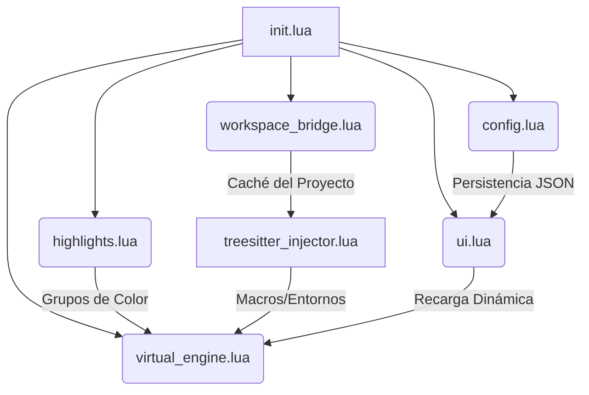
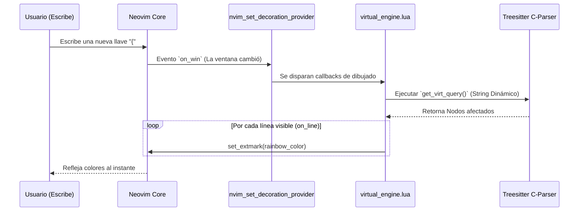

# 🛠️ Manual del Desarrollador - ArtTex SourceColor

Este documento describe la arquitectura interna, el flujo de datos y las funciones clave detrás del rendimiento hiper-optimizado de **ArtTex SourceColor**.

---

## 🏛️ Arquitectura Global

El plugin fue diseñado utilizando una arquitectura modular de un solo sentido para garantizar el mínimo consumo de CPU (0%) e interrupciones en la escritura. Está construido sobre **Treesitter** y los **Decorators Providers** nativos de Neovim (`nvim_set_decoration_provider`).

### 1. `init.lua`
**Propósito:** Punto de entrada y controlador principal del ciclo de vida.
- Ejecuta `setup()` para inicializar configuraciones, atar los Autocmds principales (`BufEnter`, `ColorScheme`) y registrar los comandos (`ArtSourceColorConfig`).
- Es responsable de forzar a Neovim a encender `cursorline` en archivos LaTeX para que el número de línea resalte de acuerdo a las paletas de color.

### 2. `config.lua`
**Propósito:** Maneja el estado global y la persistencia de las opciones del usuario.
- **`load_json()`:** Lee `~/.config/nvim/arttexsourcecolor_config.json` e inyecta (`vim.tbl_deep_extend`) las selecciones del usuario (temas, toggles y `custom_groups`) en memoria.
- **`save_json()`:** Escribe de vuelta al disco las configuraciones cada vez que el usuario interactúa con la interfaz gráfica.

### 3. `themes.lua` y `highlights.lua`
**Propósito:** Desacoplar el estilo visual de la lógica del motor.
- **`themes.lua`:** Actúa como un diccionario puramente de datos conteniendo paletas predefinidas (ej. `tokyonight`, `catppuccin_mocha`).
- **`highlights.lua`:** Toma la paleta activa en memoria y genera dinámicamente los Highlight Groups nativos de Neovim (como `ArtTexEnvTheorem`, `ArtTexCustomGroup_MiMacro`). Tiene una función `apply_globals()` que se dispara ante cada cambio de tema para evitar sobreescrituras (FOUC).

### 4. `workspace_bridge.lua` y `treesitter_injector.lua`
**Propósito:** Extender dinámicamente el coloreado leyendo las definiciones propias del proyecto del usuario.
- **`sync_with_workspace()`:** Busca y lee asíncronamente el archivo `.arttex.json` oculto en la raíz del proyecto. Consume 0% de CPU al anclarse a eventos del FileSystem (Inotify).
- **`injector.inject()`:** Toma los comandos extraídos y los inyecta en la gramática global para que `virtual_engine` pueda detectarlos al vuelo.

---

## ⚡ El Núcleo: `virtual_engine.lua`

Este es el corazón de la bestia. Para lograr resaltado semántico (como paréntesis arcoíris precisos y marcado de bloques matemáticos) sin el lag típico de expresiones regulares, implementamos el motor de decoración asíncrono.

### Funciones Críticas en `virtual_engine.lua`:
- **`get_virt_query(bufnr)`:** Construye en tiempo real el string S-Expression (lisp-like) para Treesitter dependiendo de qué características (`features`) el usuario activó. Esta función inyecta iterativamente los `custom_groups` para cazarlos sin tener que recorrer arrays en Lua. Almacena la query generada en una caché global para no reconstruirla hasta que cambie la configuración.
- **`on_line(...)`:** Se ejecuta miles de veces por segundo **únicamente en las líneas visibles**. Itera sobre los nodos devueltos por Treesitter e inyecta Extmarks extremadamente baratos en recursos (`ephemeral = true`).
- **Cálculo de profundidad (Rainbow Brackets):** Utiliza `node:parent()` para escalar por el árbol AST de Treesitter en C y saber exactamente cuántas llaves envuelven al nodo actual, asignándole un color modular `((depth % 6) + 1)`.
- **Filtro `is_package`:** Bloque recursivo con caché `O(1)` (en `_G.arttex_error_ignore_cache`) que consulta el módulo de configuración externo de `arttexworkspace`. Ignora subrayados de errores sintácticos (`ArtTexError`) si el archivo tiene extensión de desarrollo (`.sty`/`.cls`) o pertenece a los `library_paths`.

---

## 🖥️ `ui.lua` (Interfaz Gráfica)
**Propósito:** Control total para el usuario sin fricción.
Utiliza el `menu_builder` nativo del ecosistema `arttexworkspace` para dibujar paneles flotantes, ofreciendo checkboxes (`` / ``) e inyección al vuelo. Si el usuario alterna una función (por ejemplo, apagar Errores de Sintaxis), la interfaz manda a destruir la query cacheada de `virtual_engine` obligándola a recompilar y excluir dicho nodo del dibujado para liberar carga de CPU.
