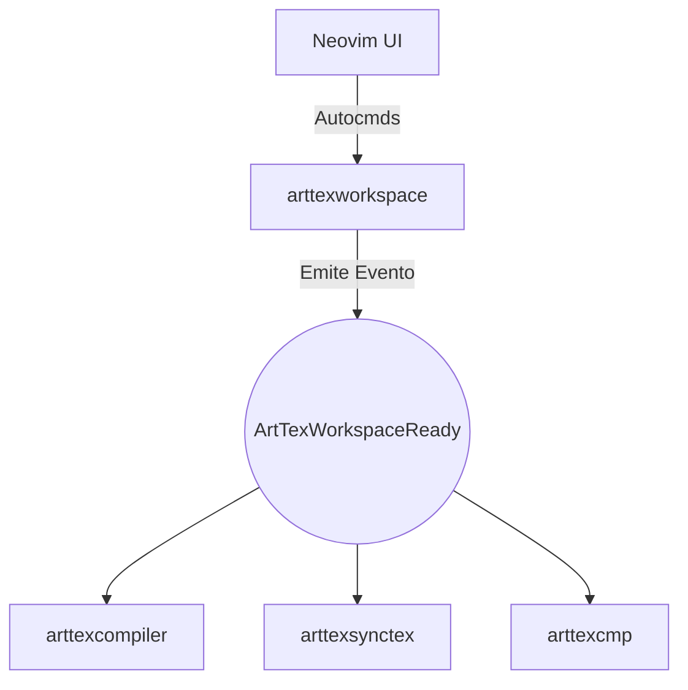

# Capítulo 1: Introducción y Filosofía del Ecosistema ArtTeX

## 1.1 ¿Por qué nace ArtTeX?
Históricamente, la edición de documentos LaTeX en Vim/Neovim ha estado dominada por plugins monolíticos (como VimTeX) o integraciones puras de Language Server Protocols (TexLab). Si bien estas herramientas son poderosas, presentan cuellos de botella fundamentales en su arquitectura que provocan lag en la interfaz de usuario (UI blocking) al procesar proyectos multi-archivo gigantes.

ArtTeX nace para resolver la ecuación: **Velocidad Extrema (Zero-Lag) + Indexación Semántica Global**.

## 1.2 La Regla de los 16 Milisegundos
Para mantener la fluidez en Neovim (60 FPS), el hilo principal no puede bloquearse por más de 16 milisegundos. ArtTeX traslada el 99% de las operaciones pesadas al backend asíncrono utilizando:
1. **libuv (vim.uv):** Llamadas no bloqueantes al sistema de archivos C para validar existencias de archivos, marcas de tiempo y resoluciones de path.
2. **Event Loop Scheduler:** Uso exhaustivo de `vim.schedule()` para sincronizar los resultados calculados asíncronamente con la UI del editor, sin congelarlo.
3. **Subprocesos y RPCs:** Invocaciones a herramientas en C o Rust, como `ripgrep` o `latexmk`, que reportan su status a través de `jobstart` y callbacks en segundo plano.

## 1.3 Arquitectura Modular Constelacional
ArtTeX no es un solo plugin. Es una *constelación* de plugins independientes. Si una pieza se rompe, las demás continúan funcionando. 
- **`arttexworkspace`**: El cerebro y router de eventos. Descubre dependencias y administra el estado.
- **`arttexcompiler`**: Gestor de trabajos del SO. Coordina latexmk, pdftex y xelatex.
- **`arttexsynctex`**: Puente bidireccional IPC con el visor PDF (Zathura, Sioyek).
- **...y 12 plugins más**

