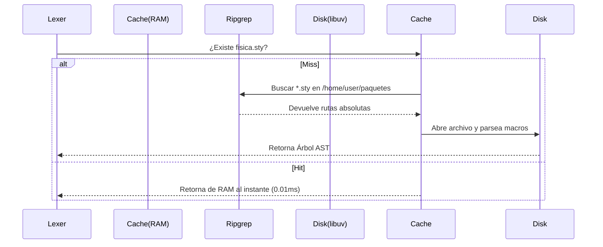

# Capítulo 4: Motor Semántico (Ripgrep Cache)

## 4.1 La Falla del Parser Monolítico
Parsear LaTeX puro es extremadamente complejo porque sus macros pueden estar esparcidos a través de docenas de archivos `.sty`, clases `.cls` e `.input` externos. Cuando TexLab o VimTeX intentan resolver estas librerías globales, generalmente sufren sobrecarga de disco (I/O Bottleneck).

## 4.2 Integración de Ripgrep
ArtTeX delega el rastreo de dependencias al buscador de texto escrito en Rust más rápido del planeta: **ripgrep (`rg`)**.

### Algoritmo de Resolución
1. El analizador lee `\usepackage{fisica}`.
2. Comprueba si `fisica.sty` está en la memoria RAM `M.file_nodes`.
3. Si no existe, invoca la subrutina `get_local_packages()`.
4. El sistema ejecuta `rg --files -g '*.sty' -g '*.cls' <rutas_globales>`.
5. Valida rígidamente `vim.v.shell_error == 0` para evitar guardar "Permission Denied" en la memoria caché.
6. Construye un diccionario local que mapea `fisica.sty -> /home/user/texmf/fisica.sty`.

## 4.3 Prevención de Loops Infinitos (Grafo Dirigido)
Dado que un archivo LaTeX puede hacer `\input{a}` que a su vez hace `\input{b}` y `b` vuelve a incluir `a`, el analizador mantiene una tabla recursiva `visited[ruta_absoluta] = true`. Si detecta un ciclo, rompe la recursión de forma segura, garantizando una complejidad temporal máxima de `O(N)` donde N es el número total de archivos únicos en el grafo del proyecto.
